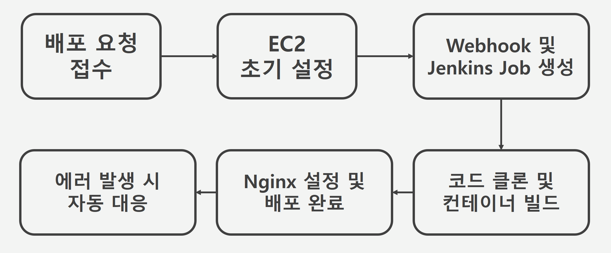
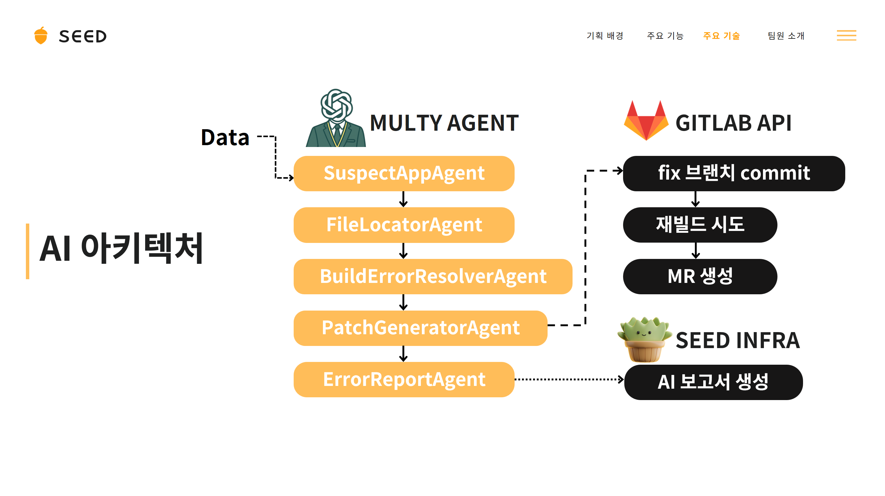

# SEED (Super E-Easy Deployment : 서버 배포 자동화 서비스)
---

> ### 목차
1. [서비스 개요 및 배경](#1-서비스-개요-및-배경)
2. [주요 기능](#2-주요-기능)
3. [서비스 흐름 및 화면 구성](#3-서비스-흐름-및-화면-구성)
5. [팀 구성 및 역할](#4-팀-구성-및-역할)

## 1. 서비스 개요 및 배경
### 1-1. 서비스 개요
> **SEED** (Super E Easy Deployment)는 EC2 서버 세팅, GitLab 자동배포 CI/CD 구축·연결, 빌드 에러 대응까지 자동화한 서비스입니다.

### 1-2. 문제 정의
- **반복되는 서버 세팅 부담**
  매번 동일한 EC2 초기 환경 구성 → 시간 소모와 휴먼 에러 발생
- **인프라 학습 장벽**
  프론트·백엔드 개발자에게는 인프라 지식이 진입장벽으로 작용
- **수동적 에러 대응**
  빌드 실패 시 로그 확인·코드 수정·재빌드 과정을 모두 개발자가 직접 수행해야 함

### 1-3. SEED 서비스의 의의
1. **자동 서버 세팅 & CI/CD 구축**
   - EC2에 Docker, Docker-Compose, Jenkins 설치 및 초기화
   - GitLab/GitHub 연동 Webhook 설정 → 자동 빌드·배포 파이프라인 완성
2. **AI 기반 빌드 에러 수정 지원**
   - 실패 로그 분석 → 관련 코드·환경 변수 자동 수정 제안
   - 재빌드를 통한 검증 → 성공 시 MR 자동 생성

### 1-4. 기대 효과
- **개발 생산성 향상**: 인프라 설정에 쓰이는 시간을 절약하고 서비스 개발에 집중
- **빠른 장애 대응**: AI 분석 → 자동 수정 → 즉시 재배포
- **쉬운 접근성**: 복잡한 CLI나 GUI 없이도 직관적인 워크플로우 제공

## 2. 주요 기능

### 2-1 원클릭 자동 배포 파이프라인인 구축
- EC2 서버에 Docker, Docker-Compose, Jenkins를 자동으로 설치·설정함  
- GitLab/GitHub 리포지토리 연동 Webhook 등록 및 Jenkins Job을 자동 생성·실행함  
- 코드 클론부터 컨테이너 빌드·배포, Nginx 설정·헬스체크까지 한 번에 처리함  

### 2-2 원클릭 HTTPS/도메인 적용
- Nginx 설치 및 리버스 프록시 기본 설정 자동화
- DNS 이름으로 사이트 이동 가능능  

### 2-2 AI 기반 빌드 에러 수정 지원
- 빌드 실패 로그를 수집하여 GPT로 분석함  
- 관련 코드·환경 변수 자동 수정안을 제안함  
- 수정 적용 후 재빌드를 시도하고, 성공 시 MR/PR을 자동 생성함  

## 3. 서비스 흐름 및 화면 구성
### 3-1. 서비스 흐름

1. **배포 요청 접수**  
   - 사용자로부터 EC2 IP(포트 22), .pem 파일, 서비스명, 어플리케이션 목록(이름·포트) 등을 입력받음
2. **EC2 초기 설정**  
   - Docker, Jenkins, 사용자의 어플리케이션 설치 및 초기화 실행
3. **webhook 설정 및 Jenkins Job 생성**
4. **코드 클론 및 컨테이너 빌드**
   - Jenkins volume에 GitLab 코드 클론
   - 빌드용(node) 및 사용자 앱 컨테이너를 Docker Compose 파일로 정의·실행함.
5. **Nginx 설정 및 배포 완료**
   - EC2에 Nginx 설치 후 `default.conf`, `nginx.conf` 생성·적용함.
   - 배포 성공 여부를 헬스체크하여 결과를 사용자에게 응답함.
6. **에러 발생 시 자동 대응**
   - 빌드 실패 로그 수집 → AI Agent가 GPT로 분석함.
   - 코드 또는 환경 설정 자동 수정 후 재빌드 시도함.
   - 성공 시 최종 MR 생성 및 요약 정보 제공함.

### 3-2. AI 아키텍처

### 3-2. 화면 구성
> Light/Dark 모드 지원 (예시는 light 모드)

<table border="1" cellspacing="0" cellpadding="8">
  <tr>
    <td align="center">
      
    </td>
    <td align="center">
      
    </td>
  </tr>
  <tr>
    <td align="center">렌딩페이지</td>
    <td align="center">로그인 페이지</td>
  </tr>

  <!-- 2번째 줄 -->
  <tr>
    <td align="center">
      
    </td>
    <td align="center">
      
      
       
      
      
      
    </td>
  </tr>
  <tr>
    <td align="center">대시보드</td>
    <td align="center">프로젝트 생성</td>
  </tr>

  <!-- 3번쨰 줄 -->
  <tr>
    <td align="center">
      
      
       
      
      
    </td>
    <td align="center">
      
    </td>
  </tr>
  <tr>
    <td align="center">프로젝트 상세</td>
    <td align="center">유저 화면</td>
  </tr>

</table>

 

## 4. 팀 구성 및 역할

<table border="1" cellspacing="0" cellpadding="8">
  <tr>
    <td align="center">
      
    </td>
    <td align="center">
      
    </td>
    <td align="center">
      
    </td>
  </tr>
  <tr>
    <td align="center">이재훈 INFRA & PM</td>
    <td align="center">김지수 INFRA & BE</td>
    <td align="center">박유진 BE</td>
  </tr>
  <tr>
    <td align="center">
      
    </td>
    <td align="center">
      
    </td>
    <td align="center">
      
    </td>
  </tr>
  <tr>
    <td align="center">강승엽 AI & BE</td>
    <td align="center">공예슬 AI & FE</td>
    <td align="center">이효승 FE</td>
  </tr>

</table>
